<p align="center">
  
</p>

<h1 align="center">✨ AndThen AI Powered Interactive Storytelling ✨</h1>

<p align="center">
  <strong>Where Your Personality Shapes Your Adventure</strong>
</p>

<p align="center">
  <a href="#features">Features</a> •
  <a href="#demo">Demo</a> •
  <a href="#tech-stack">Tech Stack</a> •
  <a href="#getting-started">Getting Started</a> •
  <a href="#project-structure">Project Structure</a> •
  <a href="#api-reference">API Reference</a>
</p>

<p align="center">
  
  
  
  
  
  
</p>

---

## 🎯 Overview

**AndThen** (also known as StoryWeave) is an innovative AI-powered storytelling platform that creates personalized, interactive narratives tailored to your unique personality. Take a scientifically-designed personality assessment, discover your character archetype, and embark on adventures where every story element is crafted specifically for you.

### 🌟 What Makes AndThen Unique?

- **Personality-Driven Narratives**: Your HEXACO personality scores directly influence story themes, conflicts, and character dynamics
- **Choose-Your-Own-Adventure**: Make meaningful choices that shape the story's direction
- **Immersive Book Themes**: Genre-specific visual themes that transform your reading experience
- **Multiplayer Stories**: Collaborate with friends on shared storytelling adventures
- **Gamification System**: Earn XP, level up, and unlock badges as you explore stories

---

## ✨ Features

### 🧠 Personality Assessment
- **16-question psychometric test** based on the HEXACO personality model
- Measures 6 core dimensions:
  - 🎯 **Conscientiousness** - Organization and discipline
  - 😰 **Neuroticism** - Emotional sensitivity
  - 🎉 **Extraversion** - Social energy
  - 🤝 **Agreeableness** - Cooperation and empathy
  - 🎨 **Openness** - Creativity and curiosity
  - 💎 **Honesty-Humility** - Sincerity and modesty
- Assigns a unique **Character Archetype** based on your profile

### 📚 AI Story Generation
- **Powered by Google Gemini AI** for dynamic, context-aware narratives
- **5 Immersive Genres**:
  | Genre | Theme | Description |
  |-------|-------|-------------|
  | 🐉 Fantasy | Ancient Grimoire | Epic quests, magic, and mythical worlds |
  | 🚀 Sci-Fi | Holographic Datapad | Future worlds and space exploration |
  | 🔍 Mystery | Detective's Case File | Puzzles, secrets, and detective work |
  | 💕 Romance | Love Letter | Love, relationships, and emotional journeys |
  | ⛰️ Adventure | Explorer's Journal | Thrilling journeys and daring exploits |

### 🎮 Interactive Gameplay
- **Real-time story streaming** with smooth animations
- **3 meaningful choices** at each decision point
- **Choice quality tracking** (Excellent → Bad)
- **Story completion** with confetti celebration
- **Auto-save progress** to continue anytime

### 👥 Multiplayer Mode
- **Create or join story rooms** with friends
- **Collaborative storytelling** with turn-based choices
- **Real-time synchronization** across players

### 🏆 Gamification
- **XP & Leveling System** - Earn experience for every action
- **Achievement Badges**:
  - 🎯 Self Discovery - Complete first personality test
  - 📖 Story Weaver - Create first story
  - 🎭 Decision Maker - Make 10 story choices
  - 👑 Story Master - Complete 5 stories
  - 🌟 Genre Explorer - Try all 5 genres

### 🎨 Visual Experience
- **Genre-specific book themes** with unique borders and backgrounds
- **Dark/Light mode** support
- **Responsive book layout** - Portrait and landscape optimization
- **Smooth Framer Motion animations**

---

## 🚀 Demo

### User Journey Flow

```mermaid
graph LR
    A[🏠 Landing Page] --> B[📝 Sign Up/Login]
    B --> C[🧠 Personality Test]
    C --> D[📊 Results & Archetype]
    D --> E[📚 Choose Genre]
    E --> F[🎮 Play Story]
    F --> G{Make Choice}
    G --> F{Nothing Much}
    G --> H[🎉 Story Complete]
    H --> I[📈 Dashboard]
```



---

## 🛠️ Tech Stack

### Frontend
| Technology | Purpose |
|------------|---------|
| **Next.js 16** | React framework with App Router |
| **React 19** | UI library with latest features |
| **TypeScript** | Type-safe development |
| **Tailwind CSS v4** | Utility-first styling |
| **Framer Motion** | Smooth animations |
| **shadcn/ui + Radix UI** | Accessible component library |

### Backend & AI
| Technology | Purpose |
|------------|---------|
| **Vercel AI SDK** | Streaming AI responses |
| **Google Gemini** | Story generation & personality analysis |
| **MongoDB + Mongoose** | User authentication & data storage |
| **JWT + bcrypt** | Secure authentication |

### Tools & Quality
| Technology | Purpose |
|------------|---------|
| **ESLint** | Code linting |
| **Vitest** | Unit testing |
| **next-themes** | Dark mode support |

---

## 🚀 Getting Started

### Prerequisites

- **Node.js** 18.x or higher
- **npm** or **yarn** or **pnpm**
- **MongoDB** instance (local or Atlas)
- **Google AI API Key** for Gemini

### Installation

1. **Clone the repository**
   ```bash
   git clone https://github.com/yourusername/and-then.git
   cd and-then
   ```

2. **Install dependencies**
   ```bash
   npm install
   ```

3. **Set up environment variables**
   
   Create a `.env` file in the root directory:
   ```env
   # MongoDB Connection
   MONGO_URI=mongodb+srv://your-connection-string
   
   # JWT Secret
   JWT_SECRET=your-super-secret-jwt-key
   
   # Google AI (Gemini)
   GOOGLE_GENERATIVE_AI_API_KEY=your-google-ai-api-key
   
   # App URL
   NEXT_PUBLIC_API_URL=http://localhost:3000
   ```

4. **Run the development server**
   ```bash
   npm run dev
   ```

5. **Open your browser**
   
   Navigate to [http://localhost:3000](http://localhost:3000)

### Production Build

```bash
npm run build
npm start
```

---

## 📡 API Reference

### Authentication

| Method | Endpoint | Description |
|--------|----------|-------------|
| `POST` | `/api/auth/signup` | Create new user account |
| `POST` | `/api/auth/login` | User login, returns JWT |
| `GET` | `/api/auth/me` | Get current user data |

### Personality

| Method | Endpoint | Description |
|--------|----------|-------------|
| `POST` | `/api/personality/save` | Save test results |
| `GET` | `/api/personality` | Get user's personality profile |

### Stories

| Method | Endpoint | Description |
|--------|----------|-------------|
| `POST` | `/api/stories/generate` | Generate AI story content (streaming) |
| `POST` | `/api/stories/save` | Save story progress |
| `GET` | `/api/stories/list` | Get user's saved stories |

### Gamification

| Method | Endpoint | Description |
|--------|----------|-------------|
| `GET` | `/api/gamification` | Get user stats (XP, level, badges) |
| `POST` | `/api/gamification` | Update user stats |

---

## 🎨 Customization

### Adding New Story Genres

1. Add genre to `STORY_GENRES` in `lib/story-data.ts`:
   ```typescript
   {
     id: "horror",
     name: "Horror",
     description: "Spine-chilling tales of terror",
     icon: "👻",
     prompt: "Create a terrifying horror story opening..."
   }
   ```

2. Add visual theme in `lib/book-themes.ts`:
   ```typescript
   horror: {
     id: "horror",
     name: "Haunted Tome",
     styles: { /* ... */ }
   }
   ```

3. Add theme assets to `public/themes/horror/`

### Customizing Personality Traits

1. Modify `PERSONALITY_TRAITS` in `lib/personality-data.ts`
2. Update `PERSONALITY_QUESTIONS` with new trait mappings
3. Adjust scoring in `calculatePersonalityScores()`

### Styling

The app uses **Tailwind CSS v4** with custom design tokens. Modify `app/globals.css` for global theme adjustments.

---

## 🗺️ Roadmap

- [x] Personality assessment with HEXACO model
- [x] AI story generation with Google Gemini
- [x] Interactive choose-your-own-adventure gameplay
- [x] Genre-specific visual themes
- [x] User authentication with MongoDB
- [x] Gamification system (XP, badges)
- [x] Multiplayer story rooms
- [ ] Story export (PDF, ePub)
- [ ] Google OAuth integration
- [ ] Mobile app (React Native)
- [ ] Story sharing & community features
- [ ] Voice narration with TTS
- [ ] Advanced AI model fine-tuning

---

## 🤝 Contributing

Contributions are welcome! Please feel free to submit a Pull Request.

1. Fork the repository
2. Create your feature branch (`git checkout -b feature/AmazingFeature`)
3. Commit your changes (`git commit -m 'Add some AmazingFeature'`)
4. Push to the branch (`git push origin feature/AmazingFeature`)
5. Open a Pull Request

---

## 📄 License

This project is licensed under the MIT License - see the [LICENSE](LICENSE) file for details.

---


<p align="center">
  Made with ❤️ by Sagar, Yogesh, Sneha
</p>

<p align="center">
  <strong>Start your personalized adventure today !!</strong>
</p>
